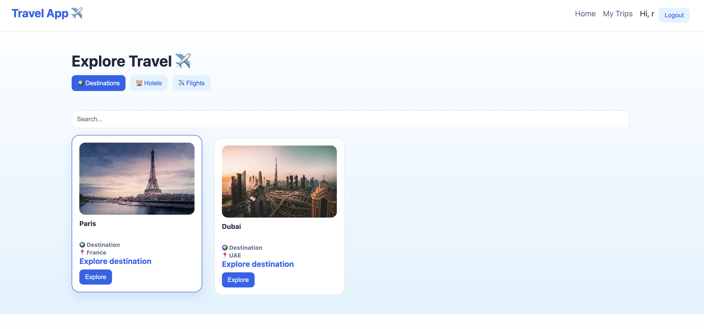
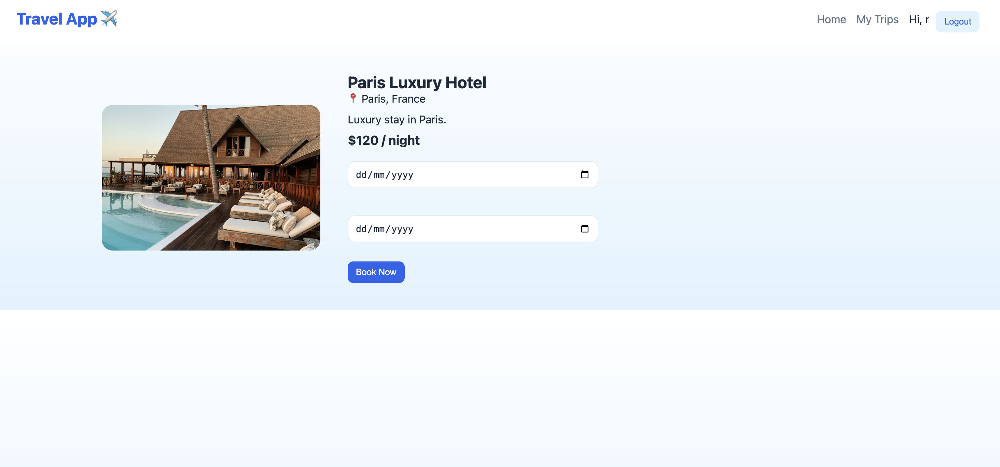
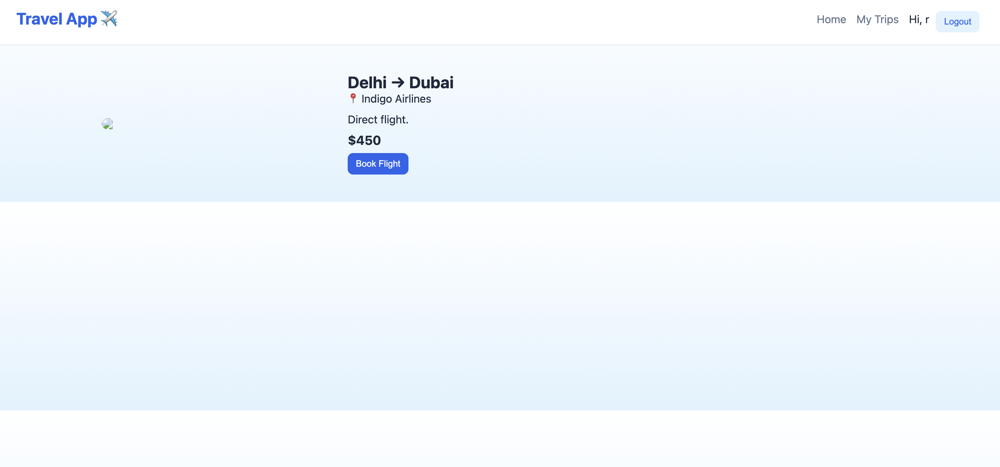
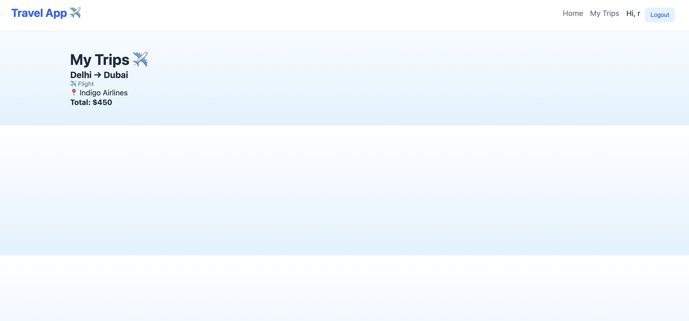
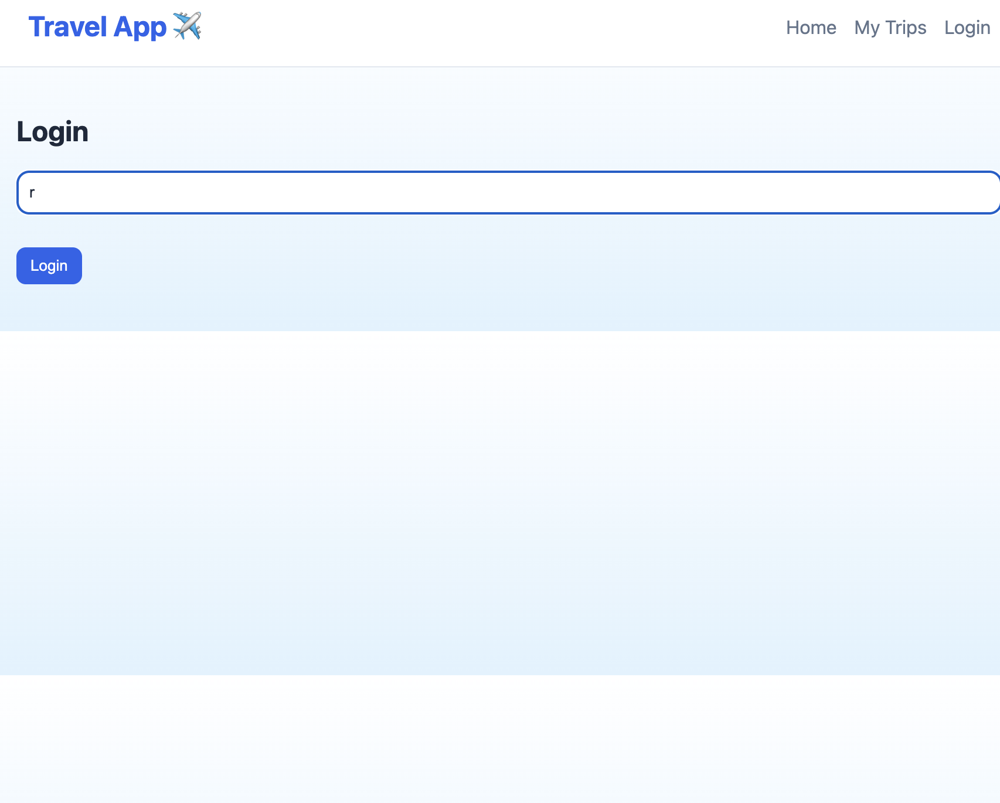

LIVE: **https://frontend-intern-project10.vercel.app/# ✈️ Travel Booking App**

A modern **React Travel Booking Application** where users can explore destinations, book hotels & flights, and manage their trips.

---

## 🚀 Features

- 🔐 Authentication (Context-based login/logout)
- 🌍 Explore Destinations, Hotels & Flights
- 🔍 Search + Filters
- 📄 Detail Pages for each item
- 🧾 Booking system with date selection
- 💾 My Trips (saved bookings)
- 👤 Per-user data (localStorage)
- 🔒 Protected Routes
- ⚡ Custom Hook (`useFetch`)
- 🎯 Clean UI with responsive design

---
## 🖼️ Screenshots

### 🏠 Home Page


### 📄 Detail Page


### 🔐 Login Page


### 🧳 My Trips


### ✅ Booking Success


---

## 🛠️ Tech Stack

- React (Vite)
- React Router DOM
- Context API
- JavaScript (ES6)
- CSS

---

## 📂 Folder Structure

---

## ⚙️ Installation

```bash
git clone https://github.com/your-username/project10-travelapp.git
cd project10-travelapp
npm install
npm run dev
